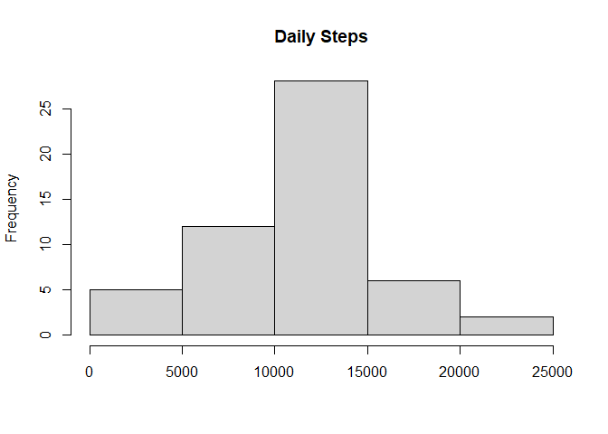
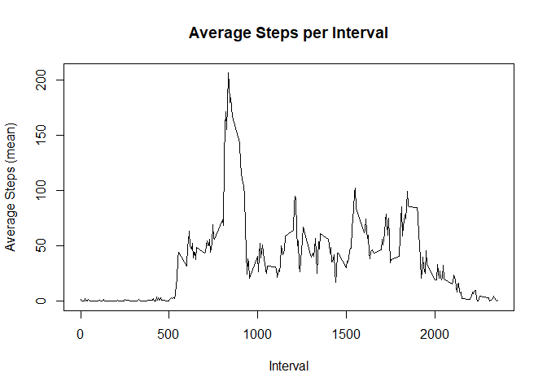
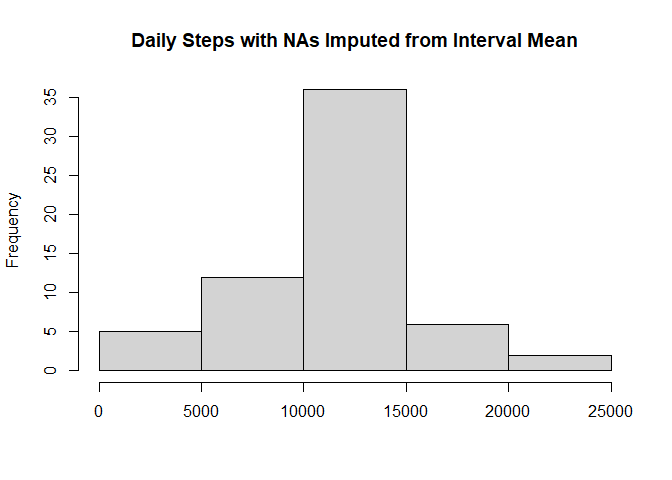
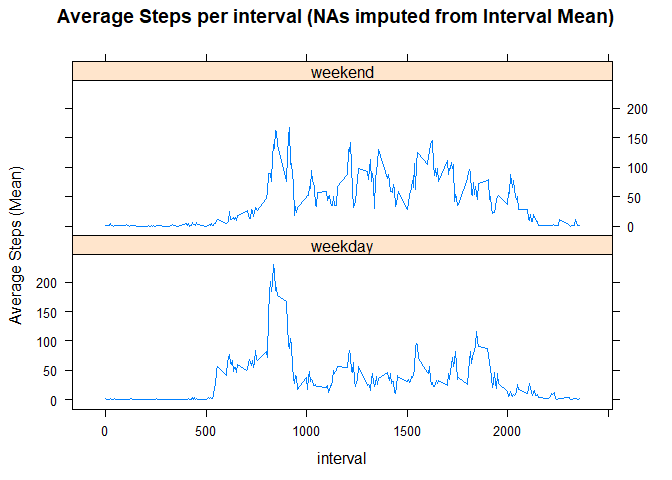

## Loading and preprocessing the data


```r
library(readr)
unzip("activity.zip")
data <- read.csv("activity.csv")
data$date <- as.Date(data$date)
```


## What is mean total number of steps taken per day?


```r
# Calculate the total number of steps taken per day
library(dplyr)
part_one <- data %>% 
  group_by(date) %>%
  summarise(total_steps = sum(steps))

# make a histogram of the total number of steps taken each day
hist(part_one$total_steps, xlab = "", main = "Daily Steps")
```

<!-- -->

```r
# calculate and report the mean
mean(part_one$total_steps, na.rm = TRUE)
```

```
## [1] 10766.19
```

```r
# calculate and report on the median
median(part_one$total_steps, na.rm = TRUE)
```

```
## [1] 10765
```


## What is the average daily activity pattern?


```r
part_two <- data %>%
  group_by(interval) %>%
  summarise(ave_steps = mean(steps, na.rm = TRUE))

# Make a time series plot (i.e. type = "l") of the 5-minute interval (x-axis) and the average number of steps taken, averaged across all days (y-axis)

with(part_two, plot(x = interval, y = ave_steps, type = "l",
     main = "Average Steps per Interval",
     xlab = "Interval",
     ylab = "Average Steps (mean)")
)
```

<!-- -->

```r
#Which 5-minute interval, on average across all the days in the dataset, contains the maximum number of steps?

part_two[which.max(part_two$ave_steps),1]
```

```
## # A tibble: 1 x 1
##   interval
##      <int>
## 1      835
```


## Imputing missing values


```r
# Calculate and report the total number of missing values in the dataset
sum(is.na(data$steps))
```

```
## [1] 2304
```

```r
# Devise a strategy for filling in all of the missing values in the dataset. The strategy does not need to be sophisticated. For example, you could use the mean/median for that day, or the mean for that 5-minute interval, etc.

# I already have the interval averages calculated in part_two so i'm going to use those
# make new dataset equal to original with NAs filled in
part_three <- data %>%
  mutate(steps = ifelse(is.na(steps),
                        part_two$ave_steps[part_two$interval %in% data$interval],
                        steps ))

# make histogram of total number of steps each day
part_three_plot_data <- part_three %>%
  group_by(date) %>%
  summarise(total_steps = sum(steps))

hist(part_three_plot_data$total_steps,
     xlab = "", 
     main = "Daily Steps with NAs Imputed from Interval Mean")
```

<!-- -->

```r
# calculate and report the mean
mean(part_three_plot_data$total_steps)
```

```
## [1] 10766.19
```

```r
# calculate and report on the median
median(part_three_plot_data$total_steps)
```

```
## [1] 10766.19
```

Imputing the NAs from the interval mean has no impact on the Mean steps per day, the impact of imputing the values from Interval Mean is that the median has increased and is now the same as the mean.  


## Are there differences in activity patterns between weekdays and weekends?


```r
# Use the dataset with the filled-in missing values for this part.

#Create a new factor variable in the dataset with two levels – “weekday” and “weekend” indicating whether a given date is a weekday or weekend day.

part_three$wd_or_we <-  factor(
  ifelse(
    weekdays(data$date) %in% c("Saturday","Sunday"), 
    "weekend", 
    "weekday"
  )
)

#Make a panel plot containing a time series plot (i.e. type = "l") of the 5-minute interval (x-axis) and the average number of steps taken, averaged across all weekday days or weekend days (y-axis).

library(lattice)

part_four <- part_three %>%
  group_by(wd_or_we, interval) %>%
  summarise(ave_steps = mean(steps))

xyplot(ave_steps ~ interval | wd_or_we, data = part_four, 
       type = "l", 
       layout = c(1,2), 
       main = "Average Steps per interval (NAs imputed from Interval Mean)", 
       ylab = "Average Steps (Mean)"
       )
```

<!-- -->

